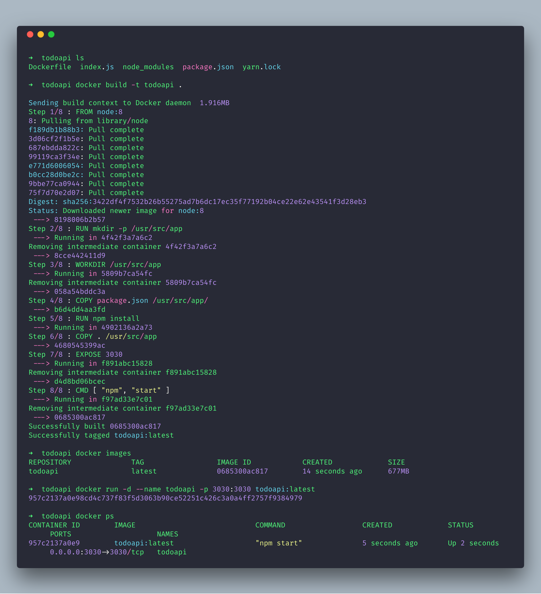

# Docker Handbook


Docker is an open platform for developers and sysadmins to build, ship, and run distributed applications, whether on laptops, data center VMs, or the cloud.

Docker is now moby project for advanced containerzation movement

https://blog.docker.com/2017/04/introducing-the-moby-project/


# Installation
  - Install docket toolbox with kinematic https://www.docker.com/products/docker-toolbox
  - after installation in some machines virtualization need to enabled follow below link            https://blogs.technet.microsoft.com/canitpro/2015/09/08/step-by-step-enabling-hyper-v-for-use-on-windows-10/
  - Now start docker console
  
## Ubuntu
  
Use below shell script to install docker on any ubuntu machines	   
```
wget -nv -O - https://get.docker.com/ | sh
```
After installation add current user to docker group

```
sudo groupadd docker
sudo usermod -aG docker ${USER}
su -s ${USER}
```
Verify docker by pulling hello-world image
```
docker run hello-world
```

For more troubleshooting in linux refer this [link](https://www.digitalocean.com/community/questions/how-to-fix-docker-got-permission-denied-while-trying-to-connect-to-the-docker-daemon-socket)
   

# Basic docker commands

  - docker run <image>
  - docker start <name|id>
  - docker stop <name|id>
  - docker ps [-a include stopped containers] - to list all docker containers
  - docker rm <name|id>
  - docker build -t <your username>/<app_name> .
  - docker-machine ssh default -- Used to SSH docker
  - docker-machine env default -- get environment commands for your new VM
  - docker-machine regenerate-certs default 
  
# Docker making TLS false
  -https://coderwall.com/p/siqnjg/disable-tls-on-boot2docker
  -Create docker machine with TLS false docker-machine create -d virtualbox --engine-opt tlsverify=false node1

  
### Installation
    - Download docker toolbox
      https://www.docker.com/products/docker-toolbox
    - Create username in docker.com
    - To dock node js app https://nodejs.org/en/docs/guides/nodejs-docker-webapp/
   
    
### Terminal 



# Launching Containers

  - To search images
  ```
  docker search --filter=stars=3 hello
  ```
# Find IP address of docker linux daemon
   ```
   docker inspect -f '{{range .NetworkSettings.Networks}}{{.IPAddress}}{{end}}' f5f5384dd63b
   ```

# Build container image

- To build a docker image first we need to create a file "Docker"
 ### This file consist of four major commands
  
```
FROM <image-name>:<tag>
RUN <command> 
COPY <src> <dest> 
EXPOSE <port> 
CMD -a arga value -b argb-value
```
   
  ### Below docker file is used to run static html files in ngnix server
   
#### Ngnix Server
```
FROM nginx:1.11-alpine
COPY index.html /usr/share/nginx/html/index.html
EXPOSE 80
CMD ["nginx", "-g", "daemon off;"]
```
#### Node Server
```
FROM node:boron
RUN mkdir -p /usr/src/app
WORKDIR /usr/src/app
COPY package.json /usr/src/app/
RUN npm install
COPY . /usr/src/app
EXPOSE 8080
CMD [ "npm", "start" ]
```
    
   
  # Build and running image into container

  - After creation of docker file run command to take a build of image 
    ```
    docker build -t <any-name> .
    ```
    
  - To verify run below command this will list image with given name
    ```
    docker images
    
    REPOSITORY                    TAG                 IMAGE ID            CREATED             SIZE
    my-nodejs-app                 latest              50bdaca3105f        11 hours ago        667 MB
    node                          boron               e0fb852254e6        5 days ago          659 MB
    jenkins                       latest              ee06af673de2        2 weeks ago         713 MB
    kitematic/hello-world-nginx   latest              03b4557ad7b9        20 months ago       7.91 MB
    
    ```
    
  - Below command launch the built image is 
    ```
    docker run -d --name my-running-app -p 3000:3000 my-nodejs-app  
    sudo docker run -d  --name hostapp -p 8082:4000 hostapp
    docker run --name prometheus -d -p 127.0.0.1:9090:9090 name
    ```
    This binds port 4000 of the container to port 8082 on 127.0.0.1(ip) of the host machine. The Docker User Guide explains in detail how to   manipulate ports in Docker.
    
  - After running above command go to tcp url with port 3000 
    ```
    192.168.99.100:32768
    
    or
    
    curl 192.168.99.100:32768
    ```
    
  - To verify build is present in container 
    ```
    $ docker ps

    CONTAINER ID        IMAGE                  COMMAND             CREATED             STATUS              PORTS                     NAMES
    df289bf2768a        my-nodejs-app:latest   "npm start"         2 minutes ago       Up 2 minutes        0.0.0.0:32768->7899/tcp   my-nodejs-app-2
    ```
  
# Containers are Always Running with Docker’s Restart Policy

- Automatically restart crashed containers by specifying a restart policy 

Even though our application crashes continues to exit with an error, Docker is continuously restarting the container every time it exits.

 ```sh
 $ sudo docker run -d —name hello-app —restart always hello-app 
 ```

  
  
  ### Troubleshooting
   
   #### Docker daemon port (usually <ip>:2376), may not work properly.
    
- To resolve this do following steps , Goto  Virtualbox > Preferences -> Network -> Host-only Network and remove all adapters listed.
	  
- Remove existing docker machine 
    ```sh
    $ docker-machine rm default
    ```
- Create new virtual machine 
	```
	docker-machine create --driver virtualbox default
	```

- Create new virtual machine 
	```
	docker-machine create --driver virtualbox default
	```
- Set machine as 
	```
	eval "$(docker-machine env default)"
	```
	
	
	
   #### Windows Docker daemon not started after machine restart 
   
  - docker-machine regenerate-certs default
	- docker-machine restart default
	- eval $(docker-machine env default)
	- docker-machine ls
	
  - docker daemon configuration
 	https://docs.docker.com/engine/admin/#troubleshoot-the-daemon

  
# Docker best UI
  - Ship yard https://github.com/shipyard/shipyard
  - Portainer https://github.com/portainer/portainer

# Usefull links for docker service configuration
  - https://docs.docker.com/engine/installation/linux/ubuntu/#uninstall-docker
  - https://docs.docker.com/engine/admin/
  - https://docs.docker.com/engine/security/certificates/#understanding-the-configuration
  - https://docs.docker.com/engine/reference/commandline/dockerd/
    

# Container Commands
  - docker ps -aq - List all container id
  - docker stop $(docker ps -aq) Stop all running containers
  - docker rm $(docker ps -aq) Remove all containers
  - docker rmi $(docker images -q) Remove all images
  - docker container ls --all - List all container details
  - docker update --restart=always (container-id) - Run docker container automatically
  
# Swarm Commands
  - docker swarm init
  - docker node ls

# Uninstall Docker 
  - sudo apt-get purge docker-ce
  - sudo rm -rf /var/lib/docker
