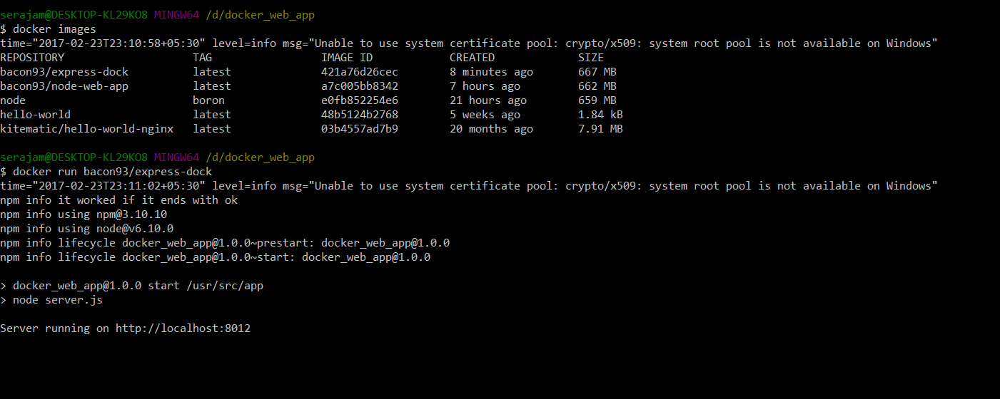

# Docker Handbook


Docker is an open platform for developers and sysadmins to build, ship, and run distributed applications, whether on laptops, data center VMs, or the cloud.

# Basic docker commands

  - docker run <image>
  - docker start <name|id>
  - docker stop <name|id>
  - docker ps [-a include stopped containers] - to list all docker containers
  - docker rm <name|id>
  - docker build -t <your username>/<app_name> .
  
  
### Installation
    - Download docker toolbox
      https://www.docker.com/products/docker-toolbox
    - Create username in docker.com
    - To dock node js app https://nodejs.org/en/docs/guides/nodejs-docker-webapp/
    
### Terminal 



# Launching Containers

  - To search images
  ```
  docker search --filter=stars=3 hello
  ```
# Build container image

  - To build a docker image first we need to create a file "Docker"
  - This file consist of four major commands
    ```
    FROM <image-name>:<tag>
    RUN <command> 
    COPY <src> <dest> 
    EXPOSE <port> 
    CMD -a arga value -b argb-value
    ```
